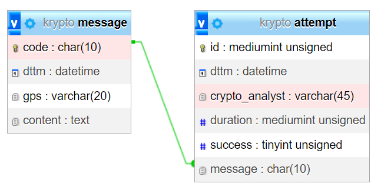

# Databáze

[Zpět na README.md](../README.md)

## Tabulky

### message

| název atributu | datový typ  | klíč | modifikátory integritního omezení |
| -------------- | ----------- | ---- | --------------------------------- |
| code           | VARCHAR(10) | PK   | NN                                |
| dttm           | DATETIME    |      | NN                                |
| gps            | VARCHAR(20) |      | NN                                |
| content        | TEXT        |      | NN                                |

### attempt

| název atributu | datový typ  | klíč | modifikátory integritního omezení |
| -------------- | ----------- | ---- | --------------------------------- |
| id             | MEDIUMINT   | PK   | NN, AI, UN                        |
| dttm           | DATETIME    |      | NN                                |
| crypto_analyst | VARCHAR(45) |      | NN                                |
| duration       | MEDIUMINT   |      | NN, UN                            |
| success        | TINYINT     |      | NN, UN, DEF=0                     |
| message        | CHAR(10)    | FK   | NN                                |

## Snímek obrazovky z návrháře v phpMyAdminu



## SQL dotazy

1. **Vytvoří tabulku pro šifrované zprávy s názvem „message“, která bude obsahovat nalezené šifry dle výše uvedeného zadání.**

   ```sql
   CREATE TABLE IF NOT EXISTS`message`(
    `code`char(10) COLLATE utf8mb4_general_ci NOT NULL,
    `dttm`datetime NOT NULL,
    `gps`varchar(20) COLLATE utf8mb4_general_ci NOT NULL,
    `content` text COLLATE utf8mb4_general_ci NOT NULL,
    PRIMARY KEY (`code`)
   ) ENGINE=InnoDB DEFAULT CHARSET=utf8mb4 COLLATE=utf8mb4_general_ci;
   ```

2. **Uložení nově nalezeného zašifrovaného textu do DB. Tento text zní „joha“, nalezen byl zde (50.91295N, 14.6171E) a právě teď (v době zadání práce).**

   ```sql
   INSERT INTO message (code, dttm, gps, content) VALUES ('2024-B-003', '2024-04-28 14:25', '50.91295N, 14.6171E', 'joha');
   ```

3. **Smazání všech pokusů o rozšifrování zprávy s kódem 2024-B-003.**

   ```sql
   DELETE FROM attempt WHERE message = "2024-B-003";
   ```

4. **Seznam všech zašifrovaných zpráv (kód, datum – den nalezení) seřazených dle celkové délky pokusů o rozšifrování od nejdelšího. Tedy jak dlouho na nich kryptoanalytici strávili čas od toho nejnáročnějšího.**

   ```sql
   SELECT m.code, m.dttm, SUM(a.duration) "doba"
   FROM message m JOIN attempt a ON a.message = m.code
   GROUP BY m.code
   ORDER BY SUM(a.duration) DESC;
   ```

5. **Seznam všech kryptoanalytiků (jméno) s počtem zpráv, které úspěšně rozluštili.**

   ```sql
   SELECT crypto_analyst, COUNT(crypto_analyst) "úspěchů"
   FROM attempt
   WHERE success=1
   GROUP BY crypto_analyst
   ORDER BY COUNT(crypto_analyst) DESC;
   ```

6. **Pomocí SQL zajistěte, aby se po smazání záznamu z tabulky „message“ smazaly automaticky i pokusy o rozšifrování.**

   ```sql
   ALTER TABLE `attempt`
       ADD CONSTRAINT `FK_message` FOREIGN KEY (`message`) REFERENCES `message` (`code`) ON DELETE CASCADE ON UPDATE CASCADE;
   ```
