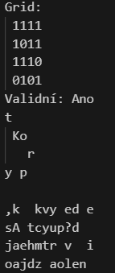

# Program v PHP

Toto je řešení v jazyku **PHP**.

- [Zpět na README.md](../../README.md)
- [Řešení v jazyku Python](../python/python.md)

## Řešení

Nejprve jsem si vytvořil dvě mřížky. Jako formát jsem zvolil JSON, protože v něm lze velice jednoduše vyjádřit 2D pole a také se velmi jednoduše načítá do pole v jazyku PHP. Jako alternativu bych případně zvolil CSV. Vytvořil jsem si dvě mřížky, na kterých jsem testoval jejich načítání, validnost a nakonec samotné šifrování vstupního textu:

První mřížka je velikosti 2x2 a je totožná s příkladem mřížky ze zadání:

```json
[
  [1, 0],
  [1, 1]
]
```

Druhá mřížka je velikosti 4x4:

```json
[
  [1, 1, 1, 1],
  [1, 0, 1, 1],
  [1, 1, 1, 0],
  [0, 1, 0, 1]
]
```

Celá úloha se týká mřížky (načtení, rotace, validace, šifrování), tak jsem vytvořil třídu `Grid` a do ní metody `load`, `validate`, `rotate` a `encrypt`. Abych mřížku viděl, tak i její textovou reprezentaci `__toString` a samozřejmě `__construct`. Atributy třídy jsou pak samotná mřížka `grid` a její velikost `size`.

**1. Načtení mřížky:**

O samotné načtení mřížky se stará jeden řádek kódu:

```php
$grid = json_decode(file_get_contents(__DIR__ . '/' . $file), true);
```

V kontextu třídy `Grid` pak zabalený v metodě vypadá takto:

```php
public function load(string $file): static
{
    $this->grid = json_decode(
        file_get_contents(__DIR__ . '/' . $file),
        true
    );
    $this->size = count($this->grid);
    return $this;
}
```

**2. Rotace mřížky:**

Rotace mřížky od 90° ve směru hodinových ručiček je vlastně transponování matice (výměna řádků za sloupce) a prohození pořadí na řádků. Toto bylo napovězeno v zadání. Samotná funkce pak vypadá takto:

```php
public function rotate(): static
{
    $rotated_grid = [];
    // transform the grid
    for ($y = 0; $y < $this->size; $y++) {
        for ($x = 0; $x < $this->size; $x++) {
            $rotated_grid[$y][$x] = $this->grid[$x][$y];
        }
    }
    // reverse the items in rows
    foreach ($rotated_grid as &$row) {
        $row = array_reverse($row);
    }
    $this->grid = $rotated_grid;
    return $this;
}
```

**3. Validace mřížky:**

Aby byla mřížka validní, nesmí nikdy po svých rotacích **vícekrát zapsat do stejného místa**. Původní text by pak byl přepsán a nemohl by být již dešifrován. Validaci tedy provádím tak, že si připravím plátno `canvas` o velikosti mřížky a zapisuji do všech děr (místa s hodnotou 0) mřížky. Mřížku postupně 4x rotuji pro všechna její natočení. Pokud se vyskytne případ, že zapisuji do plátna, kde již zapsáno je, funkci ukončím s hodnotou `false`. Pokud pro všchny díry mřížky a všechna její natočení nenastane situace, že bych vícekrát zapisoval na jedno místo plátna, funkce je ukončena s návratovou hodnotou `true`.

```php
public function validate(): bool
{
    $canvas = [];
    foreach (range(0, 3) as $state) {
        for ($y = 0; $y < $this->size; $y++) {
            for ($x = 0; $x < $this->size; $x++) {
                if ($this->grid[$x][$y] == 0) {
                    if (!isset($canvas[$x][$y])) {
                        $canvas[$x][$y] = 1;
                    } else {
                        return false;
                    }
                }
            }
        }
        $this->rotate();
    }
    return true;
}
```

**4. Šifrování mřížkou:**

Šifrování samotné je podobné validaci. Postupně zapisuji do volných pocic mřížky na plátno `canvas`. Mřížku otáčím pomocí metody `rotate`. Jsou tu však tři rozdíly:

1. Na plátno zapisuji již písmena ze vstupního textu `text` dle indexu `char_index`.
2. Po vyčerpání všech pociz mřížky na jednom místě mřížku na plátně posunu doprava. K tomu slouží `grid_shift`.
3. Protože na výstupu je požadován `string`, tak musím plátno `canvas`, které je pole (`array`) na tento string převést ( proměnná `output`).

```php
public function encrypt(string $text): string
{
    $canvas = [];
    $char_index = 0;
    $grid_shift = 0;
    $end = false;
    while (!$end) {
        foreach (range(0, 3) as $state) {
            for ($y = 0; $y < $this->size; $y++) {
                for ($x = $grid_shift; $x < $grid_shift + $this->size; $x++) {
                    if (!$end && $this->grid[$y][$x - $grid_shift] == 0) {
                        $canvas[$y][$x] = $text[$char_index++];
                        if ($char_index == strlen($text)) {
                            $end = true;
                        }
                    } else if (!isset($canvas[$y][$x])) {
                        $canvas[$y][$x] = " ";
                    }
                }
            }
            $this->rotate();
        }
        $grid_shift += $this->size;
    }
    $output = '';
    foreach ($canvas as $row) {
        $output .= implode('', $row) . "\n";
    }
    return $output;
}
```

## Hlavní program

Kód:

```php
<?php
require "Grid.php";

echo $grid = (new Grid)->load("grid4x4.json");
echo "Validní: " . ($grid->validate() ? "Ano" : "Ne") . "\n";

$text = "Krypto";
echo $grid->encrypt($text) . "\n";

$text = "Ahoj, jak se tady zakum v cryptodilne vede?";
echo $grid->encrypt($text) . "\n";
```

Výstup:


