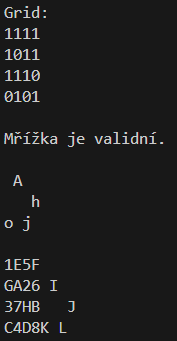

# Program v Pythonu

Toto je řešení v jazyku **Python**.

- [Zpět na README.md](../../README.md)
- [Řešení v jazyku PHP](../php/php.md)

## Řešení

Nejprve jsem si vytvořil dvě mřížky. Jako formát jsem zvolil CSV, protože je velmi jednoduchý a lze vněm velice jednoduše vyjádřit 2D pole. Vytvořil jsem si dvě mřížky, na kterých jsem testoval jejich načítání, validnost a nakonec samotné šifrování vstupního textu:

První mřížka je velikosti 2x2 a je totožná s příkladem mřížky ze zadání:

```csv
1,0
1,1
```

Druhá mřížka je velikosti 4x4:

```csv
1,1,1,1
1,0,1,1
1,1,1,0
0,1,0,1
```

Celá úloha se týká mřížky (načtení, rotace, validace, šifrování), tak jsem vytvořil třídu `Grid` a do ní metody `__init__`, `rotate`, `validate` a `encrypt`. Abych mřížku viděl, tak i její tisk `print`. Atributy třídy jsou pak samotná mřížka `grid` a její velikost `size`.

**1. Načtení mřížky:**

Načtení mřížky je řešeno v rámci třídy `Grid` jejím kontruktorem:

```python
def __init__(self, file: str):
    with open("prg/python/" + file) as f:
        self.grid = [[int(num) for num in line.split(",")] for line in f]
    self.size = len(self.grid)
```

**2. Rotace mřížky:**

Rotace mřížky od 90° ve směru hodinových ručiček:

```python
def rotate(self):
    self.grid = list(map(list, zip(*self.grid[::-1])))
```

**3. Validace mřížky:**

Aby byla mřížka validní, nesmí nikdy po svých rotacích **vícekrát zapsat do stejného místa**. Původní text by pak byl přepsán a nemohl by být již dešifrován. Validaci tedy provádím tak, že si připravím plátno `canvas` o velikosti mřížky a zapisuji do všech děr (místa s hodnotou 0) mřížky. Mřížku postupně 4x rotuji pro všechna její natočení. Pokud se vyskytne případ, že zapisuji do plátna, kde již zapsáno je, funkci ukončím s hodnotou `false`. Pokud pro všchny díry mřížky a všechna její natočení nenastane situace, že bych vícekrát zapisoval na jedno místo plátna, funkce je ukončena s návratovou hodnotou `true`.

```python
def validate(self) -> bool:
    canvas = [([0] * self.size) for _ in range(self.size)]
    for state in range(4):
        for y in range(self.size):
            for x in range(self.size):
                if self.grid[x][y] == 0:
                    if canvas[x][y] == 1:
                        return False
                    canvas[x][y] = 1
        self.rotate()
    return True
```

**4. Šifrování mřížkou:**

Šifrování samotné je podobné validaci. Postupně zapisuji do volných pocic mřížky na plátno `canvas`. Mřížku otáčím pomocí metody `rotate`. Jsou tu však tři rozdíly:

1. Na plátno zapisuji již písmena ze vstupního textu `text` dle indexu `text_index`.
2. Po vyčerpání všech pociz mřížky na jednom místě mřížku na plátně posunu doprava. K tomu slouží `grid_shift`.
3. Protože na výstupu je požadován `string`, tak musím plátno `canvas`, které je pole (`list`) na tento string převést (proměnná `output`).

```python
def encrypt(self, text: str) -> str:
    multiplier = ((len(text)-1) // self.size**2) + 1
    canvas = [([" "] * self.size*multiplier) for _ in range(self.size)]
    text_index = 0
    grid_shift = 0
    end = False
    while not end:
        for state in range(4):
            for x in range(self.size):
                for y in range(self.size):
                    if not end and self.grid[x][y] == 0:
                        canvas[x][y + grid_shift] = text[text_index]
                        text_index += 1
                        if text_index == len(text):
                            end = True
            self.rotate()
        grid_shift += self.size
    output = ""
    for x in range(len(canvas)):
        for y in range(len(canvas[0])):
            output += canvas[x][y]
        output += "\n"
    return output
```

## Hlavní program

Kód:

```python
from grid import Grid

grid = Grid("grid4x4.csv")
grid.print()

print(f"Mřížka {"je" if grid.validate() else "není"} validní.")

print(grid.encrypt('Ahoj'))

print(grid.encrypt('ABCD1234EFGH5678IJKL'))
```

Výstup:


