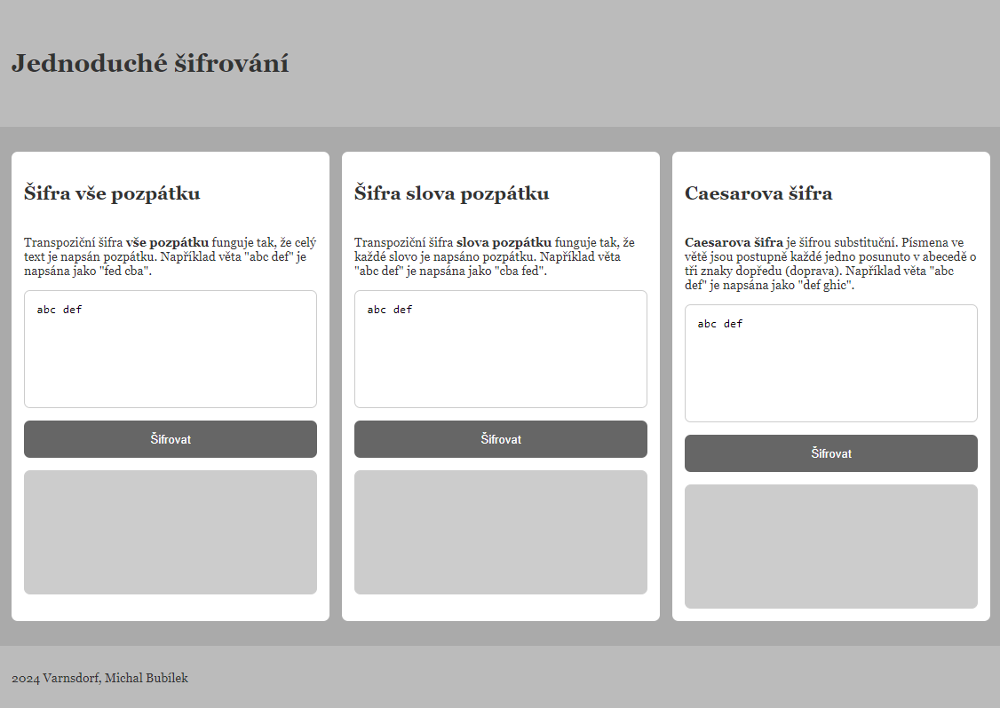

# Webová stránka

[Zpět na README.md](../README.md)

## Vytořeny byly 3 šifry

### Šifra vše pozpátku

Transpoziční šifra vše pozpátku funguje tak, že celý text je napsán pozpátku. Například věta "abc def" je napsána jako "fed cba".

### Šifra slova pozpátku

Transpoziční šifra slova pozpátku funguje tak, že každé slovo je napsáno pozpátku. Například věta "abc def" je napsána jako "cba fed".

### Caesarova šifra

Caesarova šifra je šifrou substituční. Písmena ve větě jsou postupně každé jedno posunuto v abecedě o tři znaky dopředu (doprava). Například věta "abc def" je napsána jako "def ghic".

## Technologie

Použito bylo HTML a CSS pro statickou část webu. Web je responzivní (auto grid). Pomocí Javascriptu byly naprogramovány všechny tři šifry, které jsou pověšeny na tři tlačítka na webové stránce.

## Náhled webu



## JavaScript

Jako jednoduchou ukázku do dokumwetace volím zašifrování (Caesar) textu jako obsluhu události třetího tlačítka:

```js
document.getElementById("button_3").onclick = () => {
  let val = document.getElementById("input_3").value
  val = val.replace(/[a-zA-Z]/g, function (c) {
    return String.fromCharCode(
      (c <= "Z" ? 90 : 122) >= (c = c.charCodeAt(0) + 3) ? c : c - 26
    )
  })
  document.getElementById("output_3").innerHTML = val
}
```
